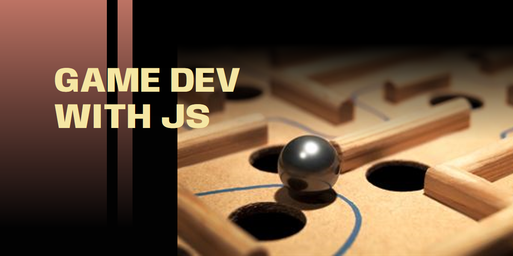
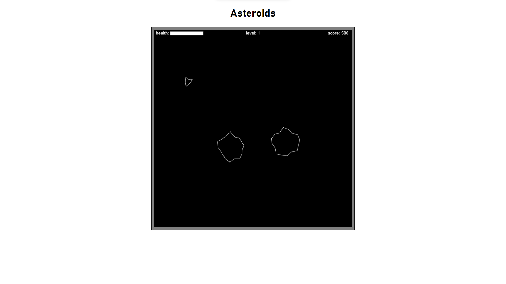

# Digikids Course || Game Development with JavaScript

## Description

This is a course to learn how to make games with JavaScript, a project of [Digikids](https://digikids.co.ke).

## Table of Contents

- HTML and the Canvas Element
- Understanding Paths
- Drawing to a design
- Basic Animation
- Basic Game Logic
- Practicing Objects
- Simple Keyboard Interaction
- Controlling the game objects
- Collision Detection
- Game Over
- Upgrading the game: adding sound, integrating with AI, game deployment.

## Game Preview

## Special Credits

Special Credits to Graeme Stuart for his book [Introducing JavaScript Game Development](https://learning.oreilly.com/library/view/introducing-javascript-game/9781484232521/) which is the basis of this course.
